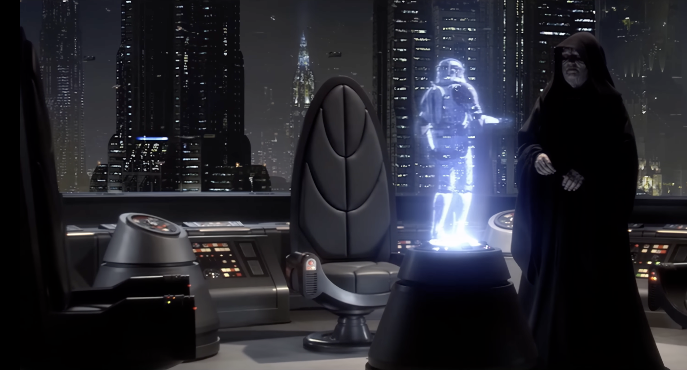

# A2A + Temporal Multi-Agent Reference System



Crash-recovery demo for multi-agent messaging using Temporal workflows and the A2A (JSON-RPC 2.0) protocol.

## What the demo proves

- Agent B crashes on the 3rd message after persisting state
- Temporal replays workflow history to rebuild state
- Processing resumes with no duplicate sends or data loss

## Architecture

```
┌─────────────┐         A2A/HTTP         ┌─────────────┐
│  Agent A    │◄────────────────────────►│  Agent B    │
│  (Port 8081)│     JSON-RPC 2.0         │  (Port 8080)│
│  TypeScript │                          │   Python    │
└──────┬──────┘                          └──────┬──────┘
       │                                        │
       │         Temporal gRPC                  │
       └────────────────┬───────────────────────┘
                        │
                   ┌────▼──────┐
                   │ Temporal  │
                   │  Server   │
                   │(Port 7233)│
                   └─────┬─────┘
                         │
                   ┌─────▼─────┐
                   │PostgreSQL │
                   └───────────┘

Additional services:
- Temporal UI: http://localhost:8233
- Langfuse UI: http://localhost:3000
- Demo driver: http://localhost:8082
```

## Prerequisites

- Docker 24+ and Docker Compose 2.x
- LM Studio local server with `google/gemma-3-1b` and API enabled

## Quick Start

```bash
cp .env.example .env
```

Minimum `.env`:
```env
LM_STUDIO_BASE_URL=http://host.docker.internal:1234/v1
LM_STUDIO_MODEL=google/gemma-3-1b
```

Start services:
```bash
docker-compose up -d
docker-compose ps
```

Run the crash recovery demo:
```bash
curl -X POST http://localhost:8082/start-task \
  -H "Content-Type: application/json" \
  -d '{"taskId": "demo-1", "turns": 3}'
```

Observe crash/recovery:
```bash
docker-compose logs -f agent-b
```

Check workflow in Temporal UI: http://localhost:8233 (workflow `task-demo-1`).

Optional Langfuse tracing:
1. Start the system.
2. Open http://localhost:3000 and create an account.
3. Generate API keys and add to `.env`:
   ```env
   LANGFUSE_PUBLIC_KEY=pk-lf-your-generated-key
   LANGFUSE_SECRET_KEY=sk-lf-your-generated-key
   ```
4. Restart agents: `docker-compose restart agent-a agent-b`

## Project Structure

```
/agent-a/    TypeScript initiator
/agent-b/    Python responder
/docker/     Postgres init
/shared/     A2A schemas
```

## Troubleshooting (short)

- LM Studio errors: confirm the LM Studio server is running and reachable from Docker
- Temporal connection refused: wait for `docker-compose ps temporal` to show healthy
- No crash: check `docker-compose logs agent-b` for `EXECUTE_ORDER_66`

## Cleanup

```bash
docker-compose down
docker-compose down -v
```

## References

- Temporal Documentation: https://docs.temporal.io/
- A2A Protocol Specification: https://anthropic.com/research/building-effective-agents
- LM Studio API Docs: https://lmstudio.ai/docs/api
- Langfuse Documentation: https://langfuse.com/docs

## License

MIT License - See LICENSE file for details

## Contributing

This is a reference implementation for educational purposes. Contributions welcome via pull requests.
